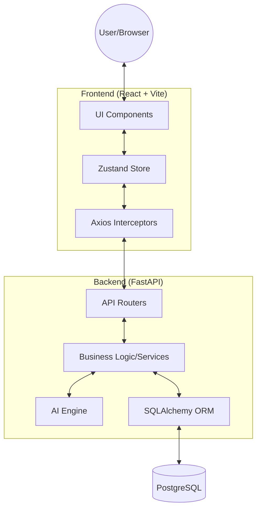

# 🥗 TrustBite: Hyperlocal Mess Discovery Platform

TrustBite is a full-stack platform designed to help students discover, evaluate, and trust local mess (dining) services. It combines crowdsourced reviews with AI-powered recommendations and official FSSAI verification data to provide a "Trust Score" for every listing.

---

## 🚀 Features

### 🎓 Student Flow
*   **Hyperlocal Search**: Find messes near your college or hostel with advanced filtering.
*   **Trust Scores**: Evaluate messes using our proprietary weighted algorithm (Rating + Hygiene + Volume + Verification).
*   **AI Recommendations**: Personalized mess suggestions based on your taste and budget.
*   **Favourites & Reviews**: Save your top picks and share verified dining experiences.

### 🍽️ Mess Owner Flow
*   **Listing Management**: Manage menus, pricing, and profile details in real-time.
*   **Performance Analytics**: View student engagement and review trends (Admin/Owner view).

### 👑 Admin Flow
*   **Platform Oversight**: Manage all users, messes, and verification states.
*   **Global Statistics**: Monitor platform health and total engagement metrics.

---

## 🛠️ Tech Stack

| Component | Technology |
| :--- | :--- |
| **Frontend** | React 19, Vite, Tailwind CSS, Framer Motion, Zustand |
| **Backend** | FastAPI (Python 3.11+), SQLAlchemy, Pydantic |
| **Database** | PostgreSQL (Production) / SQLite (Development) |
| **AI/ML** | Scikit-learn, NumPy (Content-based Filtering) |
| **Auth** | OAuth2 + JWT (Stateless Authentication) |

---

## 🏗️ Architecture



### Rationale
*   **FastAPI**: Chosen for its high performance, native async support, and automatic OpenAPI (Swagger) generation.
*   **PostgreSQL**: Provides robust relational integrity and JSONB support for future scalability.
*   **Zustand**: Lightweight state management for handling auth and global loading states without boilerplate.
*   **Framer Motion**: Enables premium, high-fidelity micro-interactions for a production-grade feel.

---

## 📂 Folder Structure

```text
TrustBite/
├── trustbite-frontend/     # React application
│   ├── src/
│   │   ├── components/     # UI, Sections, and Layouts
│   │   ├── services/       # API abstraction layer
│   │   ├── store/          # Zustand global state
│   │   └── pages/          # View components
├── trustbite-backend/      # FastAPI application
│   ├── app/
│   │   ├── core/           # Security & Configuration
│   │   ├── models/         # SQLAlchemy Schemas
│   │   ├── routers/        # API Endpoints
│   │   └── services/       # Core Logic & AI Engine
├── screenshots/            # UI Preview assets
├── DEMO_FLOW.md            # Structured guide for presentations
├── TEST_CREDENTIALS.md     # Quick-access test accounts
└── .gitignore              # Repository safety configuration
```

---

## ⚙️ Setup Instructions

### Backend Setup
1. `cd trustbite-backend`
2. `python -m venv venv`
3. `source venv/bin/activate` (or `venv\Scripts\activate` on Windows)
4. `pip install -r requirements.txt`
5. Create `.env` from `.env.example`
6. `uvicorn app.main:app --reload`

### Frontend Setup
1. `cd trustbite-frontend`
2. `npm install`
3. Create `.env` from `.env.example`
4. `npm run dev`

---

## 🔑 Demo Credentials

| Role | Email | Password |
| :--- | :--- | :--- |
| **Admin** | `admin@trustbite.com` | `Admin@123` |
| **Student** | `aryan@student.com` | `Student@123` |
| **Owner** | `ramesh@owner.com` | `Owner@123` |

---

## 📈 Environment Variables

### Backend
*   `DATABASE_URL`: Connection string for PostgreSQL/SQLite.
*   `SECRET_KEY`: JWT signing key.
*   `ALGORITHM`: JWT algorithm (Default: HS256).

### Frontend
*   `VITE_API_URL`: Backend API endpoint (Default: `http://localhost:8000/api`).

---

## 📜 License
This project is developed for educational purposes as part of the Final Year Engineering Project.
